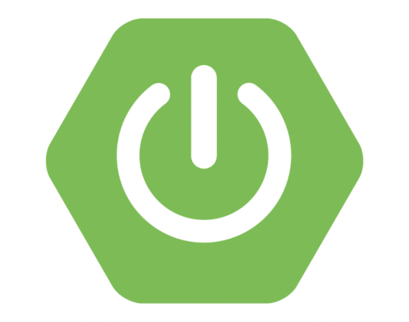
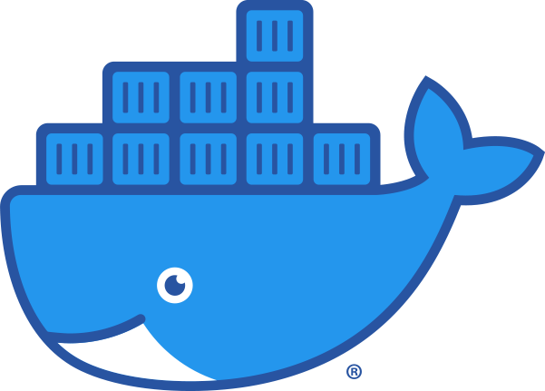

# 특화 프로젝트

## 목차

- 특화 프로젝트
  - [목차](#목차)
  - [카테고리](#카테고리)
  - [프로젝트 소개](#프로젝트-소개)
  - [팀 소개](#팀-소개)
  - [기술 스택](#기술-스택)
  - [프로젝트 진행](#프로젝트-진행)
    - [특화-sub PJT Ⅰ](#특화-sub-pjt-ⅰ)
    - [특화-sub PJT Ⅱ](#특화-sub-pjt-ⅱ)
    - [특화-sub PJT Ⅲ](#특화-sub-pjt-ⅲ)

<!-- 필수 항목 -->

## 카테고리

| Application                       | Domain                                | Language                      | Framework                            |
| --------------------------------- | ------------------------------------- | ----------------------------- | ------------------------------------ |
| :white_check_mark: Desktop Web    | :black_square_button: AI              | :white_check_mark: JavaScript | :black_square_button: Vue.js         |
| :white_check_mark:  Mobile Web    | :white_check_mark: Big Data           | :white_check_mark: TypeScript | :white_check_mark: React             |
| :white_check_mark: Responsive Web | :black_square_button: Blockchain      | :black_square_button: C/C++   | :black_square_button: Angular        |
| :black_square_button: Android App | :black_square_button: IoT             | :black_square_button: C#      | :black_square_button: Node.js        |
| :black_square_button: iOS App     | :black_square_button: AR/VR/Metaverse | :white_check_mark: Python     | :black_square_button: Flask/Django   |
| :black_square_button: Desktop App | :black_square_button: Game            | :white_check_mark: Java       | :white_check_mark: Spring/Springboot |
|                                   |                                       | :black_square_button: Kotlin  | :white_check_mark: Next.js           |

## 프로젝트 소개

- 프로젝트명 : 디코드

  > 안녕하세요
  >
  > 유저 데이터 기반 방탈출 테마 추천 서비스 디코드입니다
  >
  > 당신의 취향을 저격할 방탈출 테마가 궁금하지 않으신가요?
  >
  > 방탈출 기록은 물론 취향저격 테마로 가득한 디코드로 여러분을 초대합니다

  - 노션 : [디코드 (notion.site)](https://butter-innocent-113.notion.site/fa365241bb654b72bcb5f8d4e819066f)

- 서비스 특징

  - 유저 데이터를 기반으로 오프라인 방탈출 카페를 추천해주는 서비스

- 기간 : 2022.02.28 ~ 2022.04.08 (6주)

- 주요 기능

  | 기능                    | 내용                                                         |
  | ----------------------- | ------------------------------------------------------------ |
  | 방탈출 테마 추천 서비스 | 유저 데이터를 기반으로 오프라인 방탈출 카페 추천             |
  | 유저 방탈출 분석 그래프 | 자신이 클리어 한 방탈출 테마를 기반으로 현재 자신이 클리어한 테마들의 난이도, 장르 등 카테고리 별 시각화 |
  | 방탈출 테마정보 제공    | 디코드가 보유한 방탈출 데이터들을 사용자들이 원하는 필터에 맞춰 정보 제공 |
  
  - 상세기능
    
    - 소셜로그인
      - 네이버, 카카오, 구글 소셜로그인 제공
    - 메인페이지
      - 로그인 유저
        - 로그인한 유저 데이터 기반으로 세가지 카테고리별 1위 방탈출 테마를 추천 받음
        - 디코드가 보유한 데이터 수 시각화
      - 비로그인 유저
        - 유저 접속 지역 기반 방탈출 테마 중 평점 1위부터 3위 까지의 테마 추천
    - 프로필
      - 유저가 클리어한 방탈출 테마 분석 그래프 제공
      - 회원정보 수정 기능
    - 정보페이지
      - 디코드가 보유한 방탈출 데이터들을 사용자들이 원하는 필터에 맞춰 정보 제공
      - 테마명 클릭시 테마정보와 함께 방탈출 클리어한 유저들의 리뷰를 볼 수 있는 모달로 이동.
      - 테마명 클릭시 연결된 모달창에서 리뷰 작성 기능 제공
    - 추천페이지
      - 로그인한 유저의 장르 선호도를 기반으로 추천
      - 로그인한 유저와 비슷한 유저(성별, 연령)집단이 좋아하는 테마 추천
      - 지역별 평점 순위로 추천
    - 유저게시판
      - 유저들이 작성할 수 있는 게시판으로 게시글 작성, 수정, 댓글 기능 제공
      - 유저들이 작성한 글을 지역별로 확인 가능
      - 키워드 검색 기능 제공
    - 공지게시판
      - 관리자의 공지사항과 유저의 Q&A를 확인할 수 있는 공간으로 게시글 작성, 수정, 댓글 기능 제공
      - 관리자의 공지사항은 메인페이지 게시판 상단에서 확인 가능
      - 공개글 / 비밀글 선택 기능 제공
  
- 주요 기술

  - Single Page Application
  - CSS
  - REST API

- 배포 환경

  - URL : // 웹 서비스, 랜딩 페이지, 프로젝트 소개 등의 배포 URL 기입

<!-- 자유 양식 -->

## 팀 소개

- 손민기 : `팀장`, 프론트엔드 개발
- 김승환 : 프론트엔드 개발
- 하지애 : PM, 프론트엔드 개발
- 김경민 : 백엔드 개발
- 박소진 : 백엔드 개발
- 오윤진 : 백엔드 개발

<!-- 자유 양식 -->

## 기술 스택

### **Front-end**

|  |  |  |  |  |  |  |
| :----------------------------------------------------------: | :----------------------------------------------------------: | :----------------------------------------------------------: | :----------------------------------------------------------: | :-------------------------------------------------------: | :----------------------------------------------------------: | :----------------------------------------------------------: |
|                            HTML5                             |                             CSS3                             |                       JavaScript(ES6)                        |                           React.js                           |                          NEXT.js                          |                          TypeScript                          |                      Semantic UI React                       |

### **Back-end**

|  |  |  |  |  |  |
| :----------------------------------------------------------: | :---------------------------------------------------: | :------------------------------------------------------: | :-------------------------------------------------------: | :--------------------------------------------------------: | :------------------------------------------------------: |
|                          Springboot                          |                          JPA                          |                          Gradle                          |                          Swagger                          |                          QueryDSL                          |                          Django                          |

### **CI/CD**

|  |
| :-------------------------------------------------------: |
|                          Jenkins                          |

### **Server**

|  |  |  |  |
| :------------------------------------------------------: | :---------------------------------------------------: | :-----------------------------------------------------: | :----------------------------------------------------------: |
|                          Docker                          |                          aws                          |                         aws s3                          |                            NGINX                             |

### **DB**

|  |
| :-----------------------------------------------------: |
|                          MySQL                          |

### **Version Control**

|  |  |
|:-----------------------------------------------------------------------------------------------------------------:|:--------------------------------------------------------------------------------------------------------------:|
| Git                                                                                                               | GitLab                                                                                                         |

### **Issue Tracking System**

|  |
|:----------------------------------------------------------------------------------------------------------------------------------------------------------------------------------------:|
| Jira                                                                                                                                                                                     |

## 프로젝트 진행

### 특화-sub PJT Ⅰ

- 기간 : 2022.02.28 ~ 2022.03.04 (1주)

- 목표 : 데이터셋 분석 및 시각화

- 진행상황
  
  - [서비스를-개발하기-전-기획-고민](/문서/서비스를-개발하기-전-기획-고민/README.md)
  
  - [MVP](/문서/MVP/README.md)
  
  - [와이어프레임-작성](/문서/와이어프레임-작성/README.md)
  
  - [화면설계](/문서/화면설계/README.md)
  
  - [기술스택](/문서/기술스택/README.md)
  
    
  
    

### 특화-sub PJT Ⅱ

- 기간 : 2022.03.07 ~ 2022.03.18 (2주)

- 목표 : 기본 추천 시스템 구현

- 진행상황

  - [ERD-설계](/문서/ERD-설계/README.md)
  - [데이터전처리](/문서/데이터전처리/README.md)
  - [유저데이터](/문서/유저데이터/README.md)
  - Frontend
    - 와이어프레임 기반 페이지 별 틀 제작
      - 김승환 - 메인 페이지, 프로필, 회원가입
      - 손민기 - 추천 페이지, 정보 페이지, 상세 페이지
      - 하지애 - 공지 게시판, 유저 게시판, 방탈출 기록 작성 페이지
  - Backend
    - 와이어프레임 기반 페이지 별 Entity 구성 및 기능 개발
      - 김경민 - 유저 프로필, 회원 정보, 배포 서버 설정
      - 박소진 - 데이터가공후 db 저장, 정보 페이지, 테마 상세 페이지, 리뷰
      - 오윤진 - 공지 게시판, 유저 게시판, 댓글 작성
  
  

### 특화-sub PJT Ⅲ

- 기간 : 2022.03.21 ~ 2022.04.08 (총3주)

- 목표 : 하이브리드 추천 시스템 및 서비스 고도화

- 진행상황

  - 협업 필터링과 컨텐츠 기반 필터링을 이용한 추천 알고리즘 구현
  - 구현 기능 점검 및 보수
  - 디자인 / 기능 구현 마무리
  
  
  
