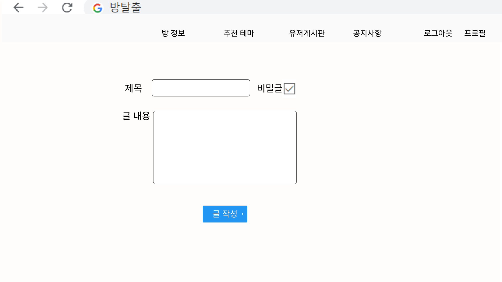

## 메인페이지 (회원)

- 로그인한 회원에게 보여지는 메인페이지입니다.
- 로그인 한 유저는 자신의 데이터를 기반으로 세가지의 카테고리별 추천 중 1위 방탈출 테마를 추천받게 됩니다.
- 가장 우측 카드를 클릭하면 더 많은 추천을  받을 수 있는 추천페이지로 이동하게 됩니다.
- 하단에는 디코드가 보유한 데이터 수를 보여줍니다.

## 메인페이지 (비회원)

- 비로그인한 상태로 비회원에게 보여지는 메인페이지입니다.
- 현재 자신이 접속한 지역의 방탈출 테마 중 평점 1위부터 3위 까지의 테마를 추천받게 됩니다.
- 가장 우측 카드를 클릭하면 추천페이지에서 추천을 받을 수 있도록 로그인 페이지로 이동합니다.

## 회원가입 추가정보 페이지

- 소셜계정을 통해 회원가입을 한 후 회원가입 추가정보 페이지로 이동합니다.
- 더 정확한 추천을 받을 수 있도록 유저의 추가 데이터를 입력 받습니다.

## 프로필페이지

- 유저의 프로필페이지입니다.
- 자신이 클리어 한 방탈출 테마를 기반으로 현재 자신이 클리어한 테마들의 난이도, 장르 등 카테고리 별로 그래프로 보여줍니다.
- 회원정보 수정 페이지가 따로 없이 커서를 올릴 경우 바로 수정할 수 있는 폼으로 바뀌게 됩니다.
- 내가 작성한 글들을 한눈에 볼 수 있도록 정리해서 보여줍니다.

## 정보 페이지

- 우리 서비스가 보유한 데이터들을 사용자들이 원하는 필터에 맞게 제공해서 보여줄 수있는 정보페이지입니다.
- 각 글들을 클릭하면 해당 테마의 상세 페이지가 모달 창으로 뜨게 됩니다.

## 상세 페이지

- 정보페이지에서 이동할 수 있는 상세페이지입니다.
- 테마 정보, 방탈출 카페 정보와 다른 유저들이 작성한 리뷰를 확인할 수 있습니다.
- 해당 테마를 완료하셨다면 방탈출 리뷰를 작성할 수 있습니다.

## 방탈출 기록 작성 페이지(상세페이지에서 처리)

- 상세페이지 모달 창으로 작성 페이지 이동
- 방탈출 기록 작성을 하게 되면 상세 페이지와 자신의 프로필 페이지에도 반영됩니다.

## 추천 페이지

- 로그인을 했을 경우에만 제공되는 추천 페이지입니다.
- 유저 데이터 기반으로 카테고리별(장르, 연령대, 성별, 지역 등) 평점이 높은 순으로 테마를 보여줍니다.

## 유저 게시판

- 유저들이 작성한 글을 지역별로 확인할 수 있는 유저게시판입니다.
- 키워드 검색을 할 수 있습니다.

## 게시글 상세 페이지

- 유저 게시글의 상세 정보를 확인할 수 있는 게시판 상세 페이지입니다.
- 유저들은 댓글을 작성할 수 있습니다.

## 게시글 작성 페이지

- 게시글 작성 페이지입니다.
- 유저 게시판의 글을 지역별로 나누어 작성할 수 있습니다.

## 공지 게시판

- 관리자의 공지사항과 유저의 Q&A를 확인할 수 있는 공지 게시판입니다.
- 공개글과 비밀글을  설정이 가능합니다.

## Q&A 작성 페이지

- 공지사항 게시판의 글을 작성할 수 있는 Q&A 작성 페이지입니다.
- 게시글은 필요에 따라 비밀글과 공개글 선택을 할 수 있습니다.